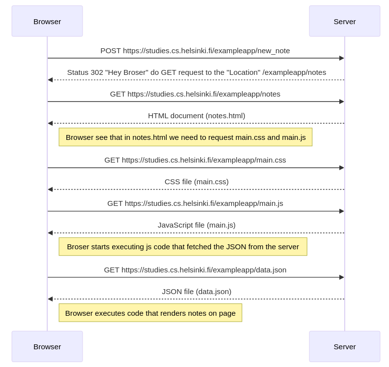

# fso-part0

sequenceDiagram

    participant Browser
    participant Server
    Browser->>Server: POST https://studies.cs.helsinki.fi/exampleapp/new_note
    Server-->>Browser: Status 302 "Hey Broser" do GET request to the "Location" /exampleapp/notes

    Browser->>Server: GET https://studies.cs.helsinki.fi/exampleapp/notes
    Server-->>Browser: HTML document (notes.html)

    Note right of Browser: Browser see that in notes.html we need to request main.css and main.js

    Browser->>Server: GET https://studies.cs.helsinki.fi/exampleapp/main.css
    Server-->>Browser: CSS file (main.css)

    Browser->>Server: GET https://studies.cs.helsinki.fi/exampleapp/main.js
    Server-->>Browser: JavaScript file (main.js)

    Note right of Browser: Broser starts executing js code that fetched the JSON from the server

    Browser->>Server: GET https://studies.cs.helsinki.fi/exampleapp/data.json
    Server-->>Browser: JSON file (data.json)

    Note right of Browser: Browser executes code that renders notes on page

Diagram:
