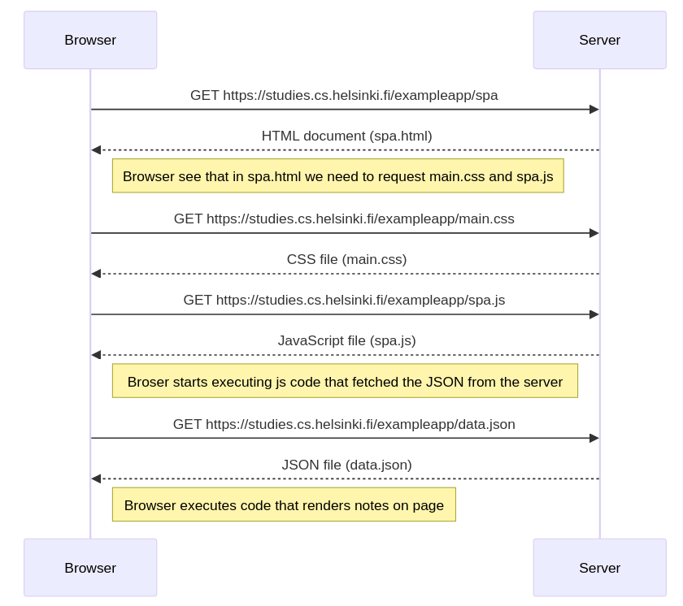

sequenceDiagram

    participant Browser
    participant Server
    Browser->>Server: GET https://studies.cs.helsinki.fi/exampleapp/spa
    Server-->>Browser: HTML document (spa.html)

    Note right of Browser: Browser see that in spa.html we need to request main.css and spa.js

    Browser->>Server: GET https://studies.cs.helsinki.fi/exampleapp/main.css
    Server-->>Browser: CSS file (main.css)

    Browser->>Server: GET https://studies.cs.helsinki.fi/exampleapp/spa.js
    Server-->>Browser: JavaScript file (spa.js)

    Note right of Browser: Broser starts executing js code that fetched the JSON from the server

    Browser->>Server: GET https://studies.cs.helsinki.fi/exampleapp/data.json
    Server-->>Browser: JSON file (data.json)

    Note right of Browser: Browser executes code that renders notes on page

### Diagram:

