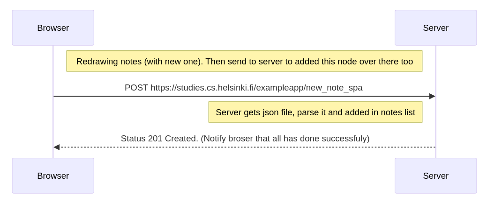

sequenceDiagram

    participant Browser
    participant Server
 
    Note right of Browser: Redrawing notes (with new one). Then send to server to added this node over there too
    Browser->>Server: POST https://studies.cs.helsinki.fi/exampleapp/new_note_spa
    
    Note left of Server: Server gets json file, parse it and added in notes list
    Server-->>Browser: Status 201 Created. (Notify broser that all has done successfuly)

### Diagram:

